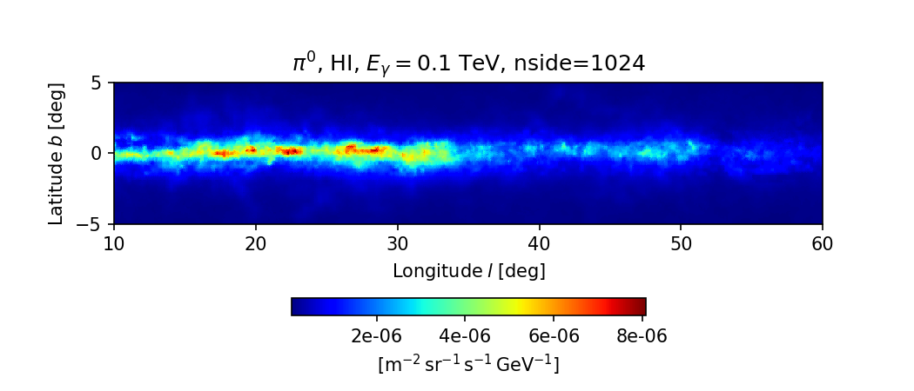

# HERMES - High-Energy Radiative MESsengers

[](https://github.com/HERMES-SkyMaps/hermes/actions)

[](https://arxiv.org/abs/2105.13165)
[](https://ascl.net/2107.030)

## About



**HERMES** is a [publicly available](https://github.com/HERMES-SkyMaps/hermes/) computational framework for the line of sight integration which creates sky maps in the [HEALPix](https://healpix.jpl.nasa.gov/)-compatible format of various galactic radiative processes including Faraday rotation, synchrotron and free-free radio emission, gamma-ray emission from pion-decay, bremsstrahlung and inverse-Compton. The name is an acronym for "High-Energy Radiative MESsengers".

The code requires C++17. Once compiled, HERMES can optionally be used from Python 3 thanks to [pybind11](https://github.com/pybind/pybind11). Some components of the code (such as galactic magnetic field models, vector and grid classes) were adopted from [CRPropa 3](https://crpropa.desy.de/), a code for cosmic ray propagation.

HERMES provides the following integrators:

- Dispersion measure
- Rotation measure
- Free-Free emission
- Synchrotron emission (with absorption)
- Pion decay gamma-ray emission
- Inverse Compton scattering
- Bremsstrahlung
- Gamma-ray emissions from Dark Matter annihilation

The complete feature list is available in the [HERMES documentation](https://hermes-skymaps.github.io/hermes-docs/components/).

## Quickstart

If [Docker](https://www.docker.com) or [Podman](https://podman.io) is installed,
one can quickly enter a Jupyter notebook with HERMES already built and available:

```sh
docker run -it --rm -p 8888:8888 quay.io/cosmicrays/jupyter-hermes:latest
```

The notebook can be accessed via web browser following the link in the output
of the above command.

For more details how to use containers see [INSTALL - Use with Docker/Podman image](INSTALL.md)
and [Jupyter Docker Stacks](https://jupyter-docker-stacks.readthedocs.io/en/latest/using/running.html).

## Install

For those who know their way around, the make-install procedure is available:

```sh
cmake -S . -B build -DDOWNLOAD_DATA=ON
cmake --build build --parallel
```

Data download is opt-in so normal CMake configuration remains offline. See
[INSTALL](INSTALL.md) for installation, package-consumer, and advanced option
examples.

For detailed installation guides and requirements see [INSTALL](INSTALL.md).

## Usage

```python
from pyhermes import *
from pyhermes.units import TeV, deg, kpc, pc

nside = 512
Egamma = 0.1*TeV
obs_pos = Vector3QLength(8.0*kpc, 0*pc, 0*pc)

skymap = GammaSkymap(nside, Egamma)
mask = RectangularWindow([5*deg, 40*deg], [-5*deg, 90*deg])
skymap.setMask(mask)

neutral_gas = neutralgas.RingModel(neutralgas.GasType.HI)
cosmicray_protons = cosmicrays.Dragon2D(Proton)
pp_crosssection = interactions.Kamae06Gamma()

integrator = PiZeroIntegrator(cosmicray_protons, neutral_gas, pp_crosssection)
integrator.setObsPosition(obs_pos)
integrator.setupCacheTable(100, 100, 20)

skymap.setIntegrator(integrator)
skymap.compute()

output = outputs.HEALPixFormat("!pizero-dragon2d.fits.gz")
skymap.save(output)
```

More examples can be found in [the examples repository](https://github.com/HERMES-SkyMaps/hermes-examples). The canonical user and developer documentation is available at [hermes-skymaps.github.io/hermes-docs](https://hermes-skymaps.github.io/hermes-docs/).

## How to cite HERMES

If you have used HERMES in a scientific project that lead to a publication, we'd appreciate you citing the paper associated with it:
```
@ARTICLE{HermesCode,
       author = {{Dundovic}, A. and {Evoli}, C. and {Gaggero}, D. and {Grasso}, D.},
        title = "{Simulating the Galactic multi-messenger emissions with HERMES}",
      journal = {\aap},
         year = 2021,
        month = sep,
       volume = {653},
          eid = {A18},
        pages = {A18},
          doi = {10.1051/0004-6361/202140801},
          url = {https://doi.org/10.1051/0004-6361/202140801},
archivePrefix = {arXiv},
       eprint = {2105.13165},
 primaryClass = {astro-ph.HE},
}
```

## Credits

| Name           | Institution                                         |
|----------------|-----------------------------------------------------|
|Andrej Dundovic | Institute for Cosmology and Philosophy of Nature, Križevci, Croatia |
|Carmelo Evoli   | Gran Sasso Science Institute, L'Aquila, Italy       |
|Daniele Gaggero | INFN Sezione di Pisa, Pisa, Italy                   |
